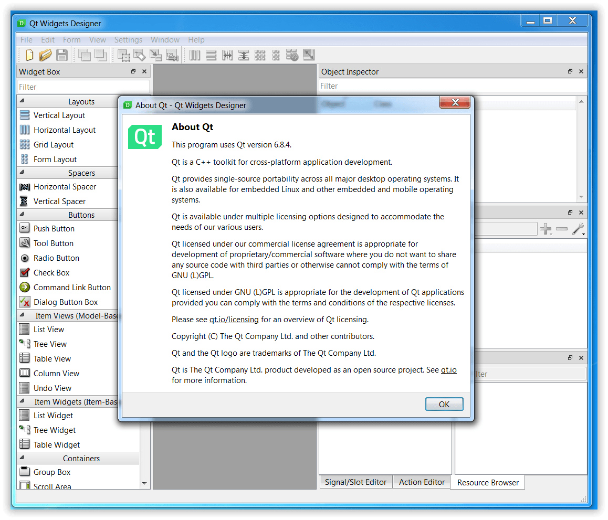

This repository provides a backport of Qt 6, tailored for compatibility with Windows 7, 8 and 8.1. It contains patched source files, along with some additional required files.

Each top-level folder here mirrors one Qt repository: apply a patch set by copying the contents of that folder over your checkout of the same name, replacing the existing files. `qtbase` is the backport proper and is always needed; `qtmultimedia` and `qtwebengine` are only needed if you build those modules. Every module is covered in its own section below.

The most recent supported version is **6.8.4** however many older versions are supported as well (see **Older versions** section).

This approach builds upon the methodology discussed in this forum [thread](https://forum.qt.io/topic/133002/qt-creator-6-0-1-and-qt-6-2-2-running-on-windows-7/60) but offers significant enhancements, including important fallbacks to the default Qt 6 behavior when running on newer versions of Windows.

You can compile it yourself using your preferred compiler and build options or can use our [compile_win.pl](https://github.com/crystalidea/qt-build-tools/tree/master/6.8.1) build script, which utilizes Visual C++ 2022 and includes OpenSSL 3.0.13 statically linked. Alternatively, you can download our [prebuild Qt dlls](https://github.com/crystalidea/qt6windows7/releases), which also include the Qt Designer binary for demonstration purposes.

**Qt 6.8.4 designer running on Windows 7**:

### qtbase

The backport proper, and the part everything else on this page assumes is in place. Stock Qt 6 imports a good number of Windows 8/8.1/10 entry points statically, so it cannot even be loaded on Windows 7. Nearly every patch here follows the same recipe: look the function up with `GetProcAddress()` at run time and fall back to the older API when it is missing, so that newer Windows keeps taking exactly the path it took before.

**corelib**

- `io/qstandardpaths_win.cpp` — low-integrity process detection is a Windows 8 concept; report false on Windows 7 instead. Also fixes the buffer-size probe of `GetTokenInformation()`.
- `kernel/qeventdispatcher_win.cpp` — `SetCoalescableTimer()`, falling back to plain `SetTimer()`.
- `kernel/qfunctions_win.cpp` — `GetCurrentPackageFullName()`; without it the process is simply not a packaged app.
- `thread/qfutex_p.h`, `thread/qmutex.cpp`, `thread/qmutex_p.h`, `thread/qmutex_win.cpp` (new) — the futex path uses `WaitOnAddress()` (Windows 8), so it is disabled and `QMutex` gets an event-based Windows implementation instead.
- `thread/qthread_win.cpp` — `SetThreadDescription()` (Windows 10) for thread names, falling back to the classic debugger exception.

**gui**

- `rhi/qrhid3d11.cpp`, `rhi/qrhid3d11_p.h` — `CreateDXGIFactory2()` (Windows 8), plus a separate swapchain path for Windows 7.
- `rhi/qrhid3d12.cpp` — `CreateDXGIFactory2()`, `D3D12CreateDevice()` and `D3D12GetDebugInterface()`; when they are absent the D3D12 backend just reports itself unavailable.
- `text/windows/qwindowsfontdatabasebase.cpp` — `SystemParametersInfoForDpi()` (Windows 10), falling back to `SystemParametersInfo()`.

**network**

- `kernel/qdnslookup_win.cpp` — `DnsQueryEx()` (Windows 8); the older `DnsQuery()` path is restored for Windows 7.

**platform plugin (windows)**

- `vxkex.h` (new) — Windows 7 stand-ins for the per-monitor DPI helpers (`GetSystemMetricsForDpi()`, `AdjustWindowRectExForDpi()` and friends), which simply scale the DPI-unaware originals.
- `qwindowscontext.h`, `qwindowscontext.cpp` — the central place where the optional user32/shcore entry points are resolved: the pointer input API (Windows 8), the per-DPI metrics and the shcore DPI awareness calls (Windows 8.1/10). The rest of the plugin asks this struct instead of calling the imports directly.
- `qwindowsdrag.cpp`, `qwindowskeymapper.cpp`, `qwindowspointerhandler.cpp`, `qwindowsscreen.cpp`, `qwindowswindow.cpp`, `qwindowsintegration.cpp` — use those resolved pointers, with the `vxkex.h` fallbacks where a DPI-aware metric is needed.
- `qwindowstheme.cpp` — accent colours come from WinRT `UISettings` on Windows 10; on Windows 7 the palette falls back to the system colours.
- `qwin10helpers.cpp` — loads `combase.dll` dynamically instead of importing it, so the WinRT helpers degrade gracefully when it is not there.
- `uiautomation/qwindowsuiawrapper_p.h`, `qwindowsuiawrapper.cpp` (new), `qwindowsuiamainprovider.cpp`, `qwindowsuiaaccessibility.cpp` — accessibility goes through a wrapper that resolves the UI Automation entry points at run time, since Windows 7 ships an older `uiautomationcore.dll`.

**widgets**

- `styles/qwindowsstyle.cpp` — the same per-DPI metric helpers as above, via `vxkex.h`.

One more file completes the set: `corelib/platform/windows/qt_winrtbase_p.h` resolves the C++/WinRT entry points (`RoGetActivationFactory()` and friends) through `combase.dll` at run time. Without it the WinRT imports alone keep the process from starting on Windows 7 — and because other modules compile against this header too, it is what lets qtmultimedia use WinRT without extra patches of its own.

### qtmultimedia

Playing media needs both the FFmpeg plugin, which would not load at all, and the WASAPI audio backend, which could not open a device and then crashed on shutdown. Four patches are provided in the `qtmultimedia` folder.

The first two concern the WinRT window capture support, compiled in whenever the `cpp_winrt` feature is enabled. Without them the plugin cannot be loaded on Windows 7, which leaves Qt Multimedia without a backend — `QMediaPlayer` reports itself unavailable and nothing plays.

- `src/plugins/multimedia/ffmpeg/CMakeLists.txt`

  The plugin linked `WindowsApp.lib`, the UWP umbrella import library. Linking it makes every plain kernel32 function resolve through `api-ms-win-core-*` API sets instead of KERNEL32.dll, and several of those sets only exist from Windows 8 onwards (`libraryloader-l1-2-0` is Windows 8.1; `synch-l1-2-0`, `localization-l1-2-0`, `heap-l2-1-0` and `processthreads-l1-1-1` are Windows 8), so the plugin cannot be loaded on Windows 7 at all. Every other Qt module imports KERNEL32.dll directly. Nothing is lost by dropping it: the WinRT entry points the plugin needs are resolved at run time through the `qt_winrtbase_p.h` replacement from the qtbase part of this backport, which `qffmpegwindowcapture_uwp.cpp` picks up via `qfactorycacheregistration_p.h`, so no static WinRT imports are left and `WindowsApp.lib` was only acting as the kernel32 umbrella.

- `src/plugins/multimedia/ffmpeg/qffmpegwindowcapture_uwp.cpp`

  The same plugin statically imports `CreateDirect3D11DeviceFromDXGIDevice` from d3d11.dll, and that export was only added in Windows 8.1. d3d11.dll itself is available on Windows 7 SP1 with the Platform Update (KB2670838, which patched qtbase needs anyway), so the module is found and just this one export is missing — enough to make the whole plugin unloadable with `ERROR_PROC_NOT_FOUND`. The function only hands a D3D11 device to the WinRT capture API, so the entire media backend was being lost for a feature unrelated to playback. The patch resolves it at run time: nothing changes on Windows 8.1 and later, while on Windows 7 only window capture fails, through the same `hresult` error path its callers already handle.

Both keep the `cpp_winrt` feature enabled, so WinRT window capture is still built and behaves exactly as before on Windows 8.1 and later; only the two Windows 8-and-later dependencies are moved from load time to run time. Configuring Qt with `-no-feature-cpp-winrt` would sidestep both problems without patching qtmultimedia, but it drops the feature everywhere, including on the newer Windows versions where it works — which is what this backport exists to avoid.

Audio needs the WASAPI backend. `createAudioClient()` activates `IAudioClient3`, an interface that only exists from Windows 10 on, so on Windows 7 activation fails and no audio device can be opened at all — and worse, `openAudioClient()` then leaves the audio client empty while the stream object lives on, so `QWASAPIAudioSinkStream::stop()` still called `audioClientStop()` on it and crashed the application with an access violation as soon as playback was closed.

- `src/multimedia/windows/qwindowsaudioutils.cpp`, `qwindowsaudioutils_p.h`, `qwindowsaudiosink_p.h`, `qwindowsaudiosource_p.h`

  The audio client is now held as the base `IAudioClient`, which has been around since Vista and carries every method the playback and capture paths actually use. `createAudioClient()` still asks for `IAudioClient3` first, so on Windows 10 and later the very same object is obtained as before and nothing changes there; only when that fails does it fall back to `IAudioClient`. Setting the endpoint role goes through `IAudioClient2::SetClientProperties` and is therefore skipped when only the base interface is available — on Windows 7 the role stays at its default. The `audioClientStart/Stop/Reset()` helpers additionally return false on an empty client instead of dereferencing it, which is what their callers already expect from a failed call and which fixes the crash on close. Both playback and capture go through these helpers, so both are covered.

Verified with Qt 6.8.4: video plays with sound on Windows 7 SP1.

### qtwebengine (Qt PDF)

The Qt PDF module is built from the qtwebengine repository and does **not** work on Windows 7 out of the box, even with patched qtbase. Two patches are provided in the `qtwebengine` folder. Only Qt PDF is covered — Qt WebEngine itself is not part of this backport.

- `src/pdf/configure/BUILD.root.gn.in`

  QtPdf linked `dloadhelper.lib`, the delay-load helper intended for UWP builds. It calls `kernel32!ResolveDelayLoadedAPI` and `DelayLoadFailureHook` through *static* imports, and both were introduced in Windows 8, so `Qt6Pdf.dll` could not be loaded at all on Windows 7 (the plugin fails with `ERROR_PROC_NOT_FOUND` — "The specified procedure could not be found"). Chromium itself links `delayimp.lib` for non-UWP builds and the patch does the same. `delayimp.lib` looks the OS helper up at run time and falls back to its own implementation when it is absent, so delay loading keeps working on every Windows version.

- `src/3rdparty/chromium/base/allocator/partition_allocator/src/partition_alloc/partition_alloc_base/rand_util_win.cc`

  PartitionAlloc obtains random bytes through `bcryptprimitives!ProcessPrng`, which exists only on Windows 10 and later. The DLL itself is present on Windows 7, so `LoadLibraryW()` succeeds and only the export lookup fails — which the surrounding `CHECK` turns into a deliberate abort (`STATUS_BREAKPOINT`), crashing the application the first time a PDF is opened. The patch falls back to `RtlGenRandom` (`advapi32!SystemFunction036`), which is what Chromium used before it switched to `ProcessPrng`. `ProcessPrng` is still preferred whenever it is available, so behaviour on Windows 10 and later is unchanged.

Verified with Qt 6.8.4: viewing PDFs works on Windows 7 SP1.

### Other modules

Many other Qt 6 modules need no patches at all: built against patched qtbase, they run on Windows 7 as they are. Verified:

- qt5compat
- qtimageformats
- qtsvg
- qttools
- ... please let me know which work and which don't !

### Known issues:

- QRhi using DirectX 11/12 is not ported

### Older versions:

- [Qt 6.8.3](https://github.com/crystalidea/qt6windows7/releases/tag/v6.8.3)
- [Qt 6.8.2](https://github.com/crystalidea/qt6windows7/releases/tag/v6.8.2)
- [Qt 6.8.1](https://github.com/crystalidea/qt6windows7/releases/tag/v6.8.1)
- [Qt 6.8.0](https://github.com/crystalidea/qt6windows7/releases/tag/v6.8.0)
- [Qt 6.7.2](https://github.com/crystalidea/qt6windows7/releases/tag/v6.7.2)
- [Qt 6.6.3](https://github.com/crystalidea/qt6windows7/releases/tag/v6.6.3)
- [Qt 6.6.2](https://github.com/crystalidea/qt6windows7/releases/tag/v6.6.2)
- [Qt 6.6.1](https://github.com/crystalidea/qt6windows7/releases/tag/v6.6.1)
- [Qt 6.6.0](https://github.com/crystalidea/qt6windows7/releases/tag/v6.6.0)
- [Qt 6.5.3](https://github.com/crystalidea/qt6windows7/releases/tag/6.5.3-win7)
- [Qt 6.5.1](https://github.com/crystalidea/qt6windows7/releases/tag/6.5.1-win7)

### License

The repository shares Qt Community Edition terms which imply [Open-Source terms and conditions (GPL and LGPL)](https://www.qt.io/licensing/open-source-lgpl-obligations?hsLang=en).
